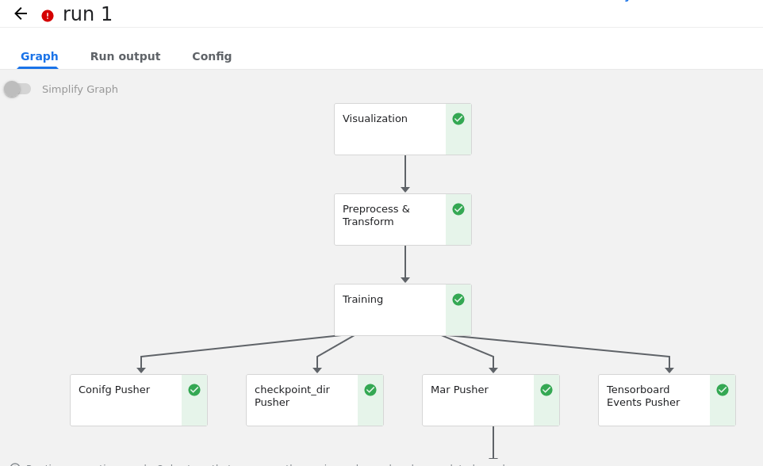
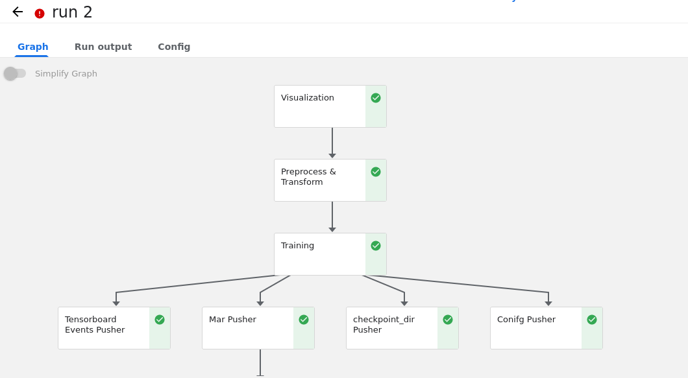
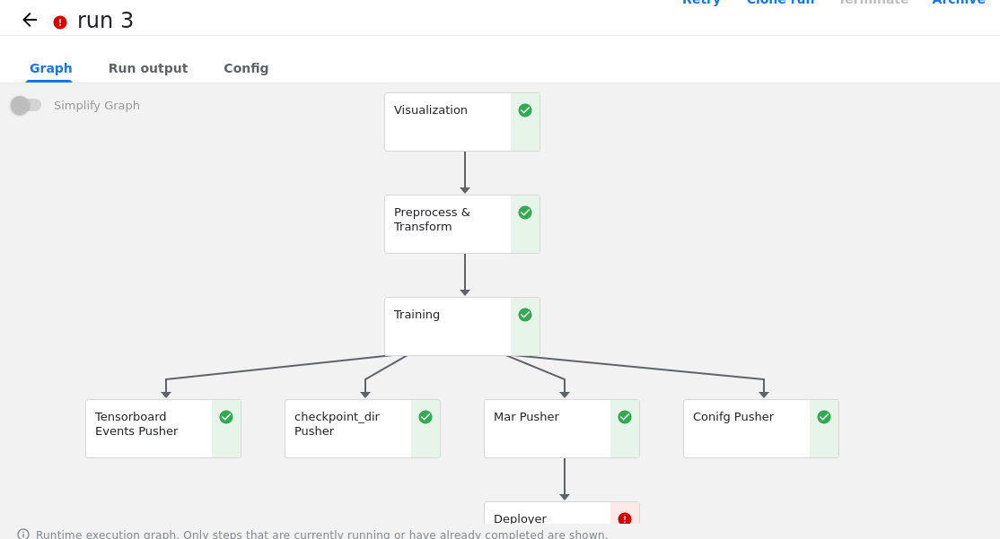
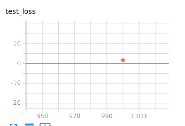
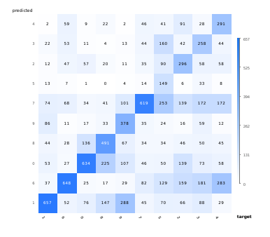

# MLPOps

#### Results on setting up Kubernetes on local system and training Res-18 on Cifar-10 locally

Didn't upload the entire repo because it didn't belong to me. Sharing results of the train runs on the local setup.

##### Screenshots of Runs
* 
* 
* 

##### Tensorboard loss curve for only 1 epoch (because of low resource setting)

##### Confusion matrix

